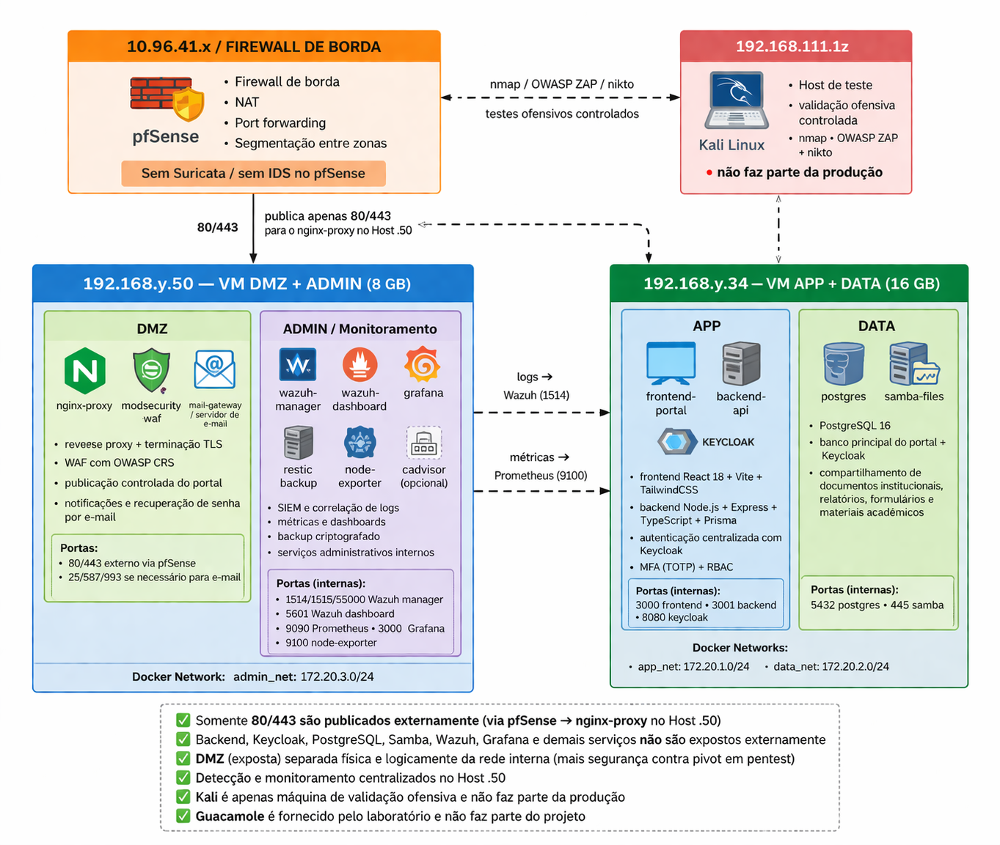
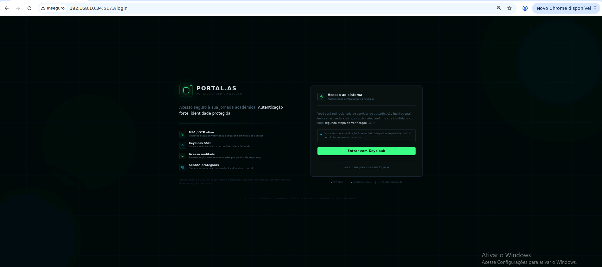
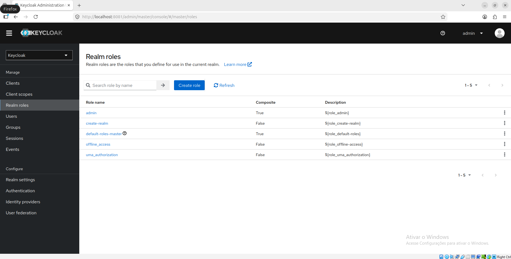
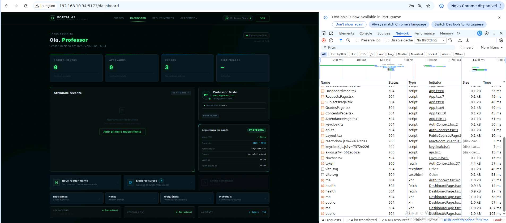
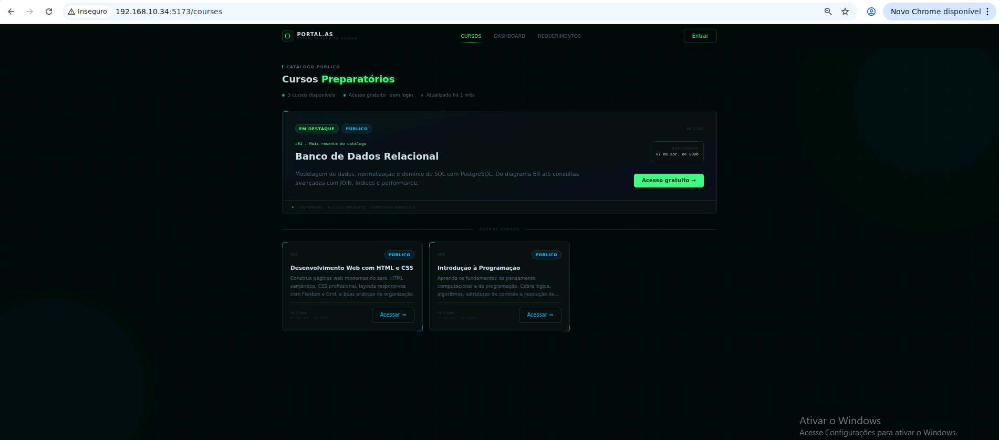

# 🔐 Portal Acadêmico Seguro (PAS)

> A secure academic portal taken through the **full security lifecycle**: secure development →
> blue-team defense & monitoring → red-team pentest (defending our own app under live attack
> from other teams, and assessing theirs).
> Portal acadêmico seguro construído do **desenvolvimento seguro** à **defesa (blue team)** e ao **pentest**.


-009639?logo=nginx&logoColor=white)


---

## Overview

A web portal for students, professors and admins (grades, enrollment proofs, requests,
public courses). It was built **security-first** and then validated as a complete exercise:
we hardened and monitored it as a **blue team**, and in a **10-team red-team round** we both
**defended it under live attack** and **assessed the other teams' authorized hosts**.

The project is documented in three phases below.

---

## Phase 1 — Secure development

The application enforces security in code, not just at the edge.

**Backend (Node.js · Express · TypeScript · Prisma · PostgreSQL)**

- **Helmet** for secure HTTP headers (HSTS, `X-Frame-Options`, `X-Content-Type-Options`, etc.);
  `crossOriginResourcePolicy` set to `cross-origin` only where the CORS frontend needs it.
- **CORS locked down** — fixed origin, methods restricted to `GET/POST/OPTIONS`, only
  `Content-Type`/`Authorization` headers allowed, no credentials.
- **Authentication via Keycloak (not home-grown).** The API validates **JWTs with RS256
  against Keycloak's JWKS** (`jwks-rsa`, key cache + rate-limited fetch), checking **issuer
  and audience**. **RBAC** comes from the token's `realm_access.roles`
  (`admin` / `professor` / `aluno` / `externo`). MFA/TOTP is enforced at Keycloak.
- **Input validation with Zod** on every request body; **request body capped at `10kb`**.
- **Strict `Content-Type`** — non-JSON bodies on `POST/PUT/PATCH` are rejected with **415**
  (so validation errors don't leak the expected field names).
- **Application-level rate limiting** with `express-rate-limit` (100 req / 15 min, standard headers),
  on top of the WAF's per-IP limiting.
- **Centralized error handler** — never returns stack traces, SQL or internal paths; unknown
  routes return a generic 404.
- **Structured logging/audit** with Winston; parameterized DB access via **Prisma** (no string-built SQL).

**Frontend (React · Vite · TypeScript · TailwindCSS · React Router · Axios)** served behind Nginx.

> See [`backend/src/app.ts`](backend/src/app.ts) (middleware chain) and
> [`backend/src/middlewares/auth.ts`](backend/src/middlewares/auth.ts) (JWT/JWKS + RBAC).

---

## Phase 2 — Blue team (defense in depth & monitoring)

The app was deployed into a **segmented network** with edge filtering, a WAF, hardening and
continuous monitoring.

| Layer | What's there |
|------|--------------|
| **Edge** | **pfSense** firewall (deny-all by default, only 80/443 exposed, WAN/server segmentation, NAT) |
| **DMZ** | **Nginx** reverse proxy with TLS 1.2/1.3, **ModSecurity WAF (OWASP CRS)** vs SQLi/XSS/CSRF, per-IP rate limiting, security headers; mail gateway |
| **App** | Frontend, backend API and **Keycloak** (MFA/TOTP, RBAC) |
| **Data** | PostgreSQL (app + Keycloak) **isolated in its own zone, never exposed externally** |
| **Monitoring** | **Wazuh SIEM**, **Prometheus** + node-exporter metrics, **Grafana** dashboards |
| **Resilience** | **Restic** encrypted backups |
| **Hardening** | AppArmor, SSH key-only, fail2ban, non-root containers, read-only volumes where possible |

### Network topology

```
Internet ─> pfSense (NAT/FW, only 80/443) ─> Host .50 — DMZ: nginx + ModSecurity (WAF) + mail
                                                       └─ ADMIN: Wazuh · Prometheus · Grafana · Restic
                                              Host .34 — APP: frontend · backend · Keycloak
                                                       └─ DATA: PostgreSQL (app + Keycloak), internal only
Kali ─ pentest/validation only
```

---

## Phase 3 — Red team / pentest (10-team round)

In the offensive round each team attacked the others' authorized hosts while defending its own.

**Defending our app (blue side).** Under live attacks the controls held:

- **SQLi → 403** and **XSS → 403** blocked by the ModSecurity WAF (OWASP CRS),
- **rate limiting → 429** under request floods,
- with corresponding **Wazuh** alerts.

Sanitized evidence is in [`video-evidencias-SPR3/`](video-evidencias-SPR3/):

- [`01-waf-rate-limit-MASCARADO.txt`](video-evidencias-SPR3/01-waf-rate-limit-MASCARADO.txt) — baseline, **SQLi → 403**, **XSS → 403**, **rate limit → 429** (addresses masked).
- [`02-ai-pentest-lab-testsuite.txt`](video-evidencias-SPR3/02-ai-pentest-lab-testsuite.txt) + [`02-resumo.txt`](video-evidencias-SPR3/02-resumo.txt) — automated suite: **232 passed / 0 failed**.
- [`SHA256SUMS.txt`](video-evidencias-SPR3/SHA256SUMS.txt) — integrity hashes · [`run-for-screenshot.sh`](video-evidencias-SPR3/run-for-screenshot.sh) — commands to reproduce.

**Assessing the other teams (red side).** I ran **authorized, read-only** recon and
vulnerability assessment (port + service-version discovery with CVE enumeration) against the
other teams' hosts, with scope guards and SHA-256 chain of custody. That tooling and the
sanitized findings are in a separate project: **[ai-pentest-lab](https://github.com/MarcoRodrigues00/ai-pentest-lab)**.

> Wazuh-alert and Grafana-dashboard captures contain internal hosts and are kept in the
> **private** evidence repo; only sanitized artifacts are public.

---

## Tech stack

- **Backend:** Node.js · Express · TypeScript · Prisma · PostgreSQL · Zod · Helmet · Keycloak (JWT/JWKS) · Winston
- **Frontend:** React · Vite · TypeScript · TailwindCSS · React Router · Axios
- **Infra / blue team:** Docker · pfSense · Nginx + ModSecurity · Keycloak · Wazuh · Prometheus · Grafana · Restic

## Repository layout

```
portal-academico-seguro/
├─ backend/                # API: Express + TypeScript + Prisma (security middleware in src/app.ts)
├─ frontend/               # React + Vite + TypeScript + Tailwind (served by Nginx)
├─ infra/                  # docker-compose, Keycloak theme, env examples
├─ video-evidencias-SPR3/  # sanitized pentest evidence (WAF 403 / 429 / test suite)
└─ docker-compose.app.yml
```

## Getting started

```bash
# 1) Copy the env templates and fill in your own values
cp .env.example .env
cp infra/.env.example infra/.env
cp backend/.env.example backend/.env
cp frontend/.env.example frontend/.env

# 2) Bring the stack up
docker compose -f docker-compose.app.yml up -d
docker compose -f docker-compose.app.yml ps
```

> 🔒 No real secrets are committed — only `.env.example` files. Never commit a real `.env`.

## 📸 Screenshots

**Network topology — pfSense edge, segmented DMZ / APP / DATA**


**Login with MFA — Keycloak SSO + TOTP**


**Keycloak — realm, roles and MFA configuration**


**Application — authenticated dashboard**


**Application — public courses view**

